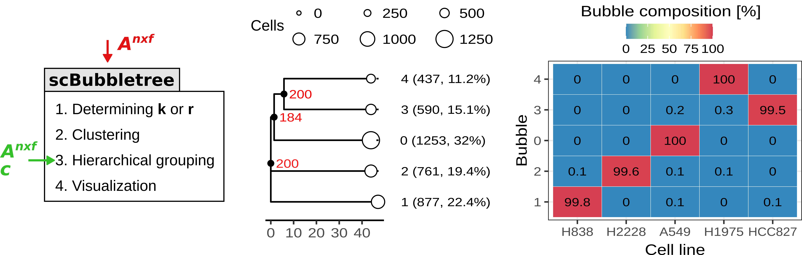

# scBubbletree

[](https://www.bioconductor.org/packages/release/bioc/html/scBubbletree.html#archives)
[](https://www.bioconductor.org/packages/scBubbletree)

## Overview 
Single cell RNA sequencing allows us to interrogate the expression of thousands of 
genes at single cell resolution. The rapid growth of scRNA-seq data has also created 
an unique set of challenges: how do we *visualize* and extract useful biological 
information from the massive and high-dimensional scRNA-seq data?

scBubbletree is a scalable method for visualization of scRNA-seq data. The method 
identifies clusters of cells of similar transcriptomes and visualizes such clusters 
as “bubbles” at the tips of dendrograms (bubble trees), corresponding to quantitative 
summaries of cluster properties and relationships. scBubbletree stacks bubble trees 
with further cluster-associated information in a visually easily accessible way, thus 
facilitating quantitative assessment and biological interpretation of scRNA-seq data.

## How to use scBubbletree

scBubbletree is an R-package available from Bioconductor: 

https://bioconductor.org/packages/scBubbletree/

To install this package, start R and enter:

```r
if (!require("BiocManager", quietly = TRUE))
    install.packages("BiocManager")

BiocManager::install("scBubbletree")
```

Case studies are provided in the directory /vignettes


## Workflow & output 


